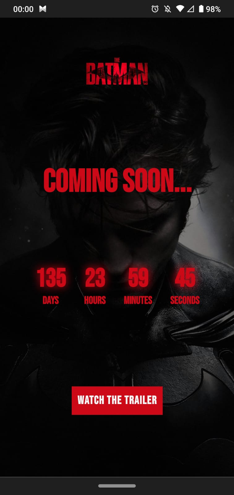

# Countdown Timer JS

## Display com contagem regressiva para o lançamento do filme [The Batman](https://www.youtube.com/watch?v=rsQEor4y2hg) nos cinemas em *04 de março de 2022*.

    

Contador funcional que usa a data atual e a de estreia do filme, para mostrar o tempo restante até o lançamento. No layout também temos um botão **Watch the trailer** que abre uma nova aba direto para o trailer mais recente disponível.

Projeto feito utilizando:
- **HTML**
- **CSS**
- **JavaScript**

-------------------

### Resultado do contador

>Gif do contador

